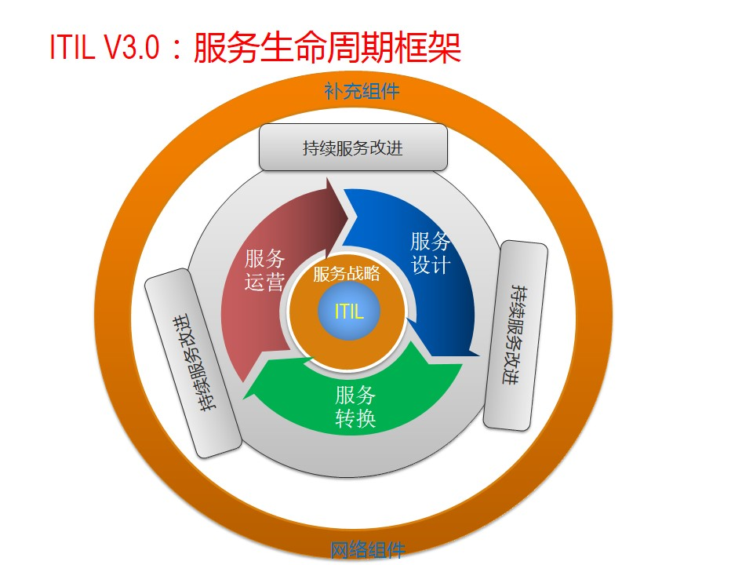

#### 一．ITIL V2 ####

- ITIL　V２核心
	+ 服务支持 --运营层面
		* 客户和用户如何获得恰当服务来支持他们的活动和业务,以及这些服务怎样得到支持
		* 组成
			- 服务台 Service Desk
			- 事件管理 Incident Management
			- 问题管理 Problem Management
			- 配置管理 Configuration Management
			- 变更管理 Change Management  ---***核心
			- 发布管理 Deliver Management
	+ 服务交付 ---战术层面
		* 客户用来支持其业务运作的服务，以及提供这些服务所需的资源
		* 组成
			- 服务级别管理 SLM  ---***核心
			- IT服务财务管理 Financial 
			- 能力管理   Capactity
			- IT服务持续性管理
			- 可用性管理

### ITIL V3核心架构 ###

- 核心架构
	+ SS 服务战略 Service Strategy
	+ SD 服务设计 Service Design
	+ ST 服务转换 Service Transition
	+ SO 服务运用 Service Operation
	+ CSI 服务持续改进 Continual Service Improvement

- ITIL V3 组成
	+ 核心架构
	+ 补充架构和组件：特定市场和特定领域
	+ 网上支持架构和组件
	
  

- ITIL 是一个闭环系统，没有终点，和 PMP由本质区别 