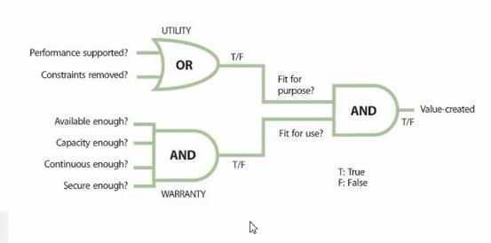
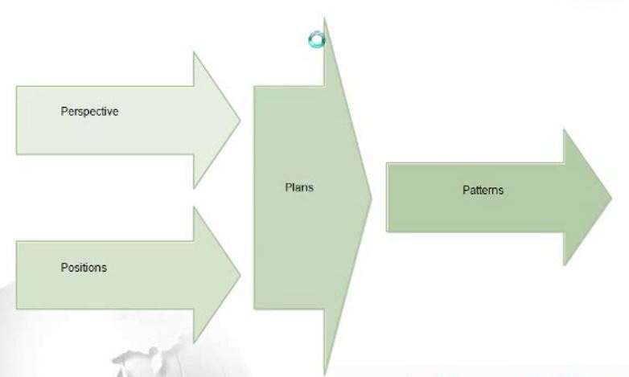

### ITIL 战略 ###

- 26个流程
	+ SS(5)
		* IT 服务战略管理
		* 服务组合管理
		* IT服务财务管理
		* 需求管理
		* 业务关系管理
	+ SD(8)
		* 设计协调
		* 服务目录管理
		* 服务级别管理
		* 可用性管理
		* 容量管理
		* 连续性管理
		* 信息安全管理
		* 供应商管理
	+ ST(7)
		* 转换计划和支持
		* 变更管理
		* 服务资产和配置管理
		* 发布和部署管理
		* 服务验证和测试
		* 变更评价
		* 知识管理
	+ SO(5)
		* 事件管理
		* 故障管理
		* 请求履行
		* 问题管理
		* 访问管理
	+ CSI(1)
		* 七步改进流程（7 step Improvdement Process)

# 服务战略 #

- 服务管理作为实践(Service Management as a Practice)
- 服务战略原则 （Service Strategy Principles)
- 服务战略流程(Service Strategy Proceesses)
	+ IT 服务战略管理 （Service Strategy Management of IT Service)
	+ 服务组合管理(Service Portfolio Management)
	+ 服务财务管理(Financial Management for IT Service)
	+ 服务需求管理(Demand Management)
	+ 业务关系管理(Bussiness Relationship Management)
- 服务战略、治理、架构和ITSM实施战略
- 服务战略的组织
- 技术考虑
- 实施服务战略
- 挑战、风险和关键成功因素

### 服务三要素 ###
- 服务要有客户
- 服务要有成果
- 服务要有价值
- 客户不用承担额外的成本和风险
- IT服务由信息技术，人和流程组成

### IT服务的要素 PPPP,PPTP ###
- People
- Process
- Product /Technology
- parnter

### 定义服务###
- What
- How

### 服务组成 (价值的两个方面) ###
- Utility of Service  服务的功用 ---可用性 Fit for purpose
	+ 性能是否支持
	+ 限制是否移除
- Warranty of Service 服务的功效 ---好用性 Fit for use
	+ 可用性是否足够 Available enough
	+ 容量是否足够  Capcity enough
	+ 连续性是否足够 Continuous enough
	+ 安全是否足够   Secure enough	
	+ 

### 服务供应商 ###
- 内部供应商 (Internal Service Provider)
- 共享服务单元 (Shared Service Unit)
- 外部供应商 (External Service Provider)

### 流程 / 职能 /角色 ###
- Process
	+ 流程是一套相关的活动，
	+ 是一个闭环系统， PDCA，不是固定的，根据实际进行调整
- Function (职能部门)
	+ 专门执行某种类型的工作单元
	+ 为特定的输出负责
	+ 构建组织去实施特殊的原则
- Roles（角色)---管理结构化的思想（每个任务由一个唯一负责的人)
	+ Process Owner ---CIO , IT Director
	+ Process Manager ---- IT  Process Manager
	+ Process Exective Operator  -- IT 

### 流程模型 ###
- 流程七个要素
	+ Input   
	+ Output 
	+ Owner 
	+ Policy
	+ Feedback
	+ Activities
	+ Metrics
- 流程特性
	+ 可度量
	+ 明确结果
	+ 交付给客户/干系人
	+ 对一个特定事件的响应
- 干系人管理原则
	+ 尽早识别
	+ 干系人重要性判定
		* 利益相关性
		* 角色影响力
	+ 干系人对项目的影响随项目进展先高后低
	+ 沟通角度遵循以下原则
		* 相关性
		* 适用性

### 服务组合 ###
- 服务管道 (Service Pipeline)
- 服务目录 (Service Catalogue)----范围管理
	+  ` 做对的事情比把事情作对更重要 `
- 退役的服务 (Retired Service)

### 孙子兵法 ###
- 道 ： 战略和方向
- 天 ： 制度和环境
- 地 :  需求 （先）
- 将 ： 人员 （后）
- 法 ： 方式和方法
- IT 目前可以参与 是以下
	+ 需求引导
	+ 人员协调
	+ 方法调整

# IT战略基础 #
- 战略本质是决定不做什么
- 战略原则（4P）
	+ Perspective(远景)
	+ Position(位置)
	+ Plans(计划)
	+ Pattern(模式)
	+ 战略是高层制定，自上而下贯彻执行，自下而上得到满足
	+ 
	
- 制定IT战略管理
	+ 目的（Purpose)
		* 定义和维护一个组织的服务和服务管理战略的4P原则
		* 保证这些战略被定义、维护并达到它的目的
	+ 目标(Objective)
		* 分析内外部环境，以发现能是组织受益的机会
		* 战略要能根据事件来加以证明，并能不断进行调整
		* 识别可能组织
	+ 对于业务价值
		*  Cost Saving
		*  增加对关键项目或服务改进的投资级别
		*  转移投资优先级
	+  策略、原则和基本概念
		*  一个组织的战略是由其管理者制定的
		*  外包商：服务战略是其核心战略组成
		*  内部IT，服务战略支持整个企业战略服务于企业的业务战略
	+  流程活动、方法和技术
		*  战略评估
		*  战略产生、评价和选择
		*  战略执行  
		*  度量和评价
	+  CSF 关键成功因素
		*  服务提供商对他们的愿景由清楚的理解
		*  定期检查
		*  保证持续关联
		*  产生、存储、维护和沟通战略计划文档的能力
	+  KPI 关键绩效指标
		*  愿景和使命的已经被定义，每个员工知道他们的角色和工作的意义
		*  每个业务单元（部门）都有一个明确的战略计划
		*  它清楚的表明改部门的活动如何与组织的愿景，使命和目标链接
		*  审计结果表明，每个利害干系人手里都有一个更新的适当的计划文档拷贝
		*  利害干系人能够提供一个与他们部门有关的战略计划文档的概览
		*  所有的文档都在控制之下，对文档的改变要走流程

